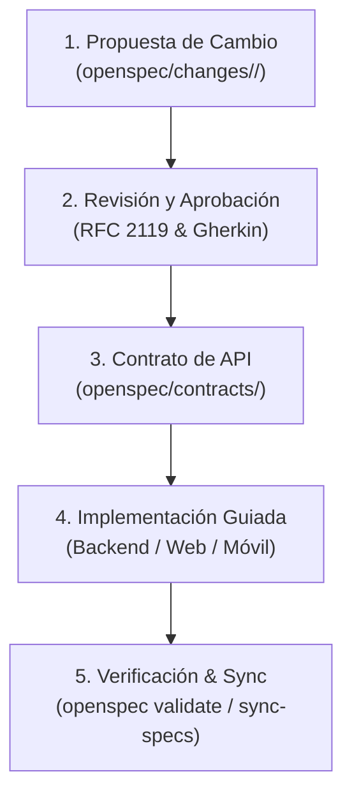

# Spec-Driven Development (SDD) Workflow - OpenSpec

Este estándar metodológico establece las reglas de desarrollo guiado por especificaciones (**Spec-Driven Development**) para la plataforma SaaS Multitenant de Telemedicina. Toda IA, agente o desarrollador humano DEBE seguir este protocolo sin excepción.

---

## 1. Regla Cardinal de Oro

> [!CAUTION]
> **PROHIBIDO CODIFICAR CÓDIGO DE PRODUCCIÓN SIN CONTRASTAR PRIMERO CONTRA LAS ESPECIFICACIONES (`openspec/specs/`) Y CONTRATOS (`openspec/contracts/`).**
> Ningún endpoint, modelo de base de datos, esquema de datos, campo de formulario o vista puede ser inventado o alterado sin estar formalmente documentado y respaldado en OpenSpec.

Las especificaciones y contratos son la **Única Fuente de Verdad (Single Source of Truth)**. El código (FastAPI, Angular, Flutter) es un subproducto ejecutable de la especificación, no al revés.

---

## 2. Ciclo de Vida de Nuevos Requerimientos y Cambios

Cuando surja una nueva funcionalidad, historia de usuario (HU), ajuste de reglas de negocio o corrección de diseño, se debe seguir estrictamente el flujo de 5 etapas:



### Etapa 1: Creación de la Propuesta de Cambio (`openspec/changes/`)
Toda modificación inicia creando una propuesta formal con OpenSpec:
```bash
openspec new change <kebab-case-name>
```
La carpeta generada en `openspec/changes/<kebab-case-name>/` contendrá:
1. `proposal.md`: Qué se va a construir, por qué, impacto multitenant y qué queda fuera del alcance (*non-goals*).
2. `specs/<capability>/spec.md`: Delta de especificación que detalla requerimientos agregados (`## ADDED Requirements`), modificados (`## MODIFIED Requirements`) o eliminados (`## REMOVED Requirements`).
3. `design.md`: Decisiones técnicas, impacto en base de datos (`tenant_id`, índices, migraciones Alembic) y arquitectura.
4. `tasks.md`: Lista secuencial de tareas agrupadas por capas (Database, Backend, Web, Mobile, Tests).

### Etapa 2: Redacción de Requerimientos y Criterios Gherkin
- Cada requerimiento funcional debe redactarse con verbos normativos RFC 2119 (`The system SHALL ...` / `The system MUST ...`).
- Los criterios de aceptación deben escribirse en formato formal **Gherkin**:
```gherkin
Scenario: [Título del escenario]
  Given [Precondición, roles y tenant context]
  When [Acción o llamada HTTP con parámetros]
  Then [Resultado esperado, código HTTP y mutación en DB]
  And [Verificación de aislamiento tenant]
```

### Etapa 3: Actualización de Contratos de API (`openspec/contracts/`)
- Si el requerimiento altera rutas, payloads, códigos HTTP o parámetros de consulta, se debe crear o actualizar el contrato correspondiente en `openspec/contracts/<dominio>.md`.
- El contrato debe incluir ejemplos de JSON reales, restricciones de tamaño, tipos nulos y encabezados requeridos (`Authorization`, `X-Tenant-ID`).

### Etapa 4: Implementación Guiada por la Especificación
- Se procede a implementar el código en las capas correspondientes (FastAPI, Angular, Flutter) siguiendo rigurosamente las `tasks.md`.
- **Fidelidad Absoluta:** No renombrar campos, no agregar columnas no especificadas y respetar las restricciones de unicidad compuestas con `tenant_id`.

### Etapa 5: Verificación y Sincronización
- Ejecutar pruebas automatizadas validando el 100% de los escenarios Gherkin.
- Validar la integridad de OpenSpec:
```bash
openspec doctor
openspec validate --specs
```
- Sincronizar las especificaciones delta con la spec principal o archivar el cambio completado:
```bash
openspec archive <change-name>
```

---

## 3. Checklist de Cumplimiento (Definition of Done - DoD)

Antes de considerar terminada cualquier tarea o PR, verificar:
- [ ] La funcionalidad está documentada en `openspec/specs/`.
- [ ] Los endpoints y payloads coinciden 1:1 con `openspec/contracts/`.
- [ ] Se incluyó el filtro de aislamiento `tenant_id` en todas las queries y mutaciones.
- [ ] Se implementaron pruebas para accesos cruzados entre inquilinos (*cross-tenant*).
- [ ] `openspec validate --specs` pasa con 0 errores y 0 advertencias.
