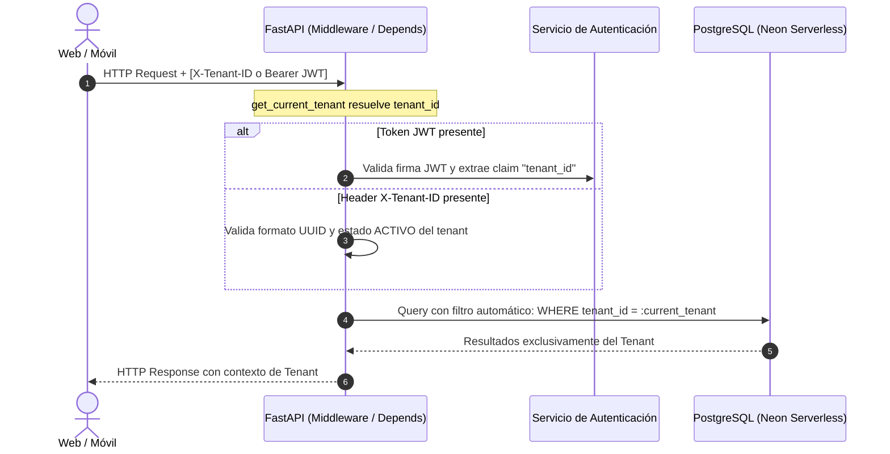
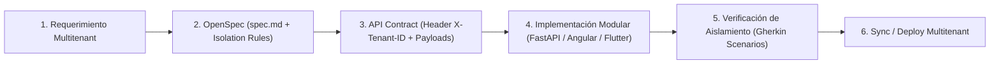

# Proyecto: Plataforma SaaS Multitenant de Telemedicina General y Especializada con Gestión Dinámica de Fichas Médicas

**Tipo de Plataforma:** Software as a Service (SaaS) Multitenant en la Nube  
**Área / Materia:** Sistemas de Información II (SI2) - Grupo 3  
**Metodología:** Spec-Driven Development (SDD) orquestado vía OpenSpec  
**Versión de Especificación:** 2.0.0 (SaaS Multi-tenant Architecture)  

---

## 1. Visión General del Proyecto (Cloud SaaS Multitenant)

La plataforma es una solución integral **Cloud SaaS Multitenant** diseñada para operar como servicio multinquilino en la nube. Permite que múltiples organizaciones de salud independientes —tales como **hospitales, clínicas privadas, policonsultorios, consultorios médicos independientes y redes de salud**— operen como **Inquilinos (Tenants)** aislados lógicamente sobre una misma infraestructura compartida y elástica.

Cada Tenant gestiona de forma autónoma:
- Su propio catálogo de profesionales médicos y especialidades.
- Sus expedientes y fichas médicas dinámicas de pacientes.
- Agendamiento de citas, salas de teleconsulta y recetas digitales.
- Roles administrativos, recepción y personal asistencial.

El desarrollo se rige estrictamente bajo la metodología **Spec-Driven Development (SDD)** orquestada con **OpenSpec**, donde las especificaciones, modelos de datos y contratos de API constituyen la única fuente de verdad (Single Source of Truth) para garantizar aislamiento estricto, integridad y cero fuga de datos entre inquilinos (*tenant data leak*).

---

## 2. Estrategia de Multitenancy y Aislamiento de Datos

### 2.1 Modelo de Datos: Pool con Discriminador (Shared Database, Shared Schema)
La plataforma adopta el patrón **Pool con Discriminador a nivel de Base de Datos**:
- **Base de Datos Compartida y Esquema Compartido (Shared Database, Shared Schema):** Todos los inquilinos coexisten en la misma base de datos relacional PostgreSQL (Neon Serverless).
- **Clave de Inquilino (`tenant_id: UUID`):** Cada tabla transaccional, clínica, de usuarios y de configuración incorpora una columna `tenant_id` de tipo `UUID` obligatoria (`NOT NULL`), indexada y con clave foránea referenciando a la tabla `tenants` (o clínicas/organizaciones).
- **Unicidad Compuesta por Tenant:** Las restricciones de unicidad de negocio (ej. número de documento de identidad C.I. o correo electrónico) se definen compuestas con `tenant_id` (`UNIQUE(tenant_id, ci)`), lo cual permite que un mismo número de identificación de paciente o usuario pueda existir en clínicas distintas sin colisión alguna.
- **Aislamiento Lógico Estricto:** Ningún inquilino puede consultar, insertar, modificar o eliminar registros que pertenezcan a un `tenant_id` diferente. Cualquier intento de acceso cruzado debe ser bloqueado a nivel de aplicación (`404 Not Found` o `403 Forbidden`).

### 2.2 Mecanismo de Resolución de Tenant en FastAPI
El backend implementa un flujo de identificación y resolución de inquilinos desacoplado y seguro:



1. **Extracción del Inquilino:**
   - **Header HTTP (`X-Tenant-ID`):** Enviado por los clientes en peticiones públicas, pre-login o cuando se opera en contexto multitenant específico.
   - **Claim en JWT (`tenant_id`):** En todas las peticiones autenticadas, el token de acceso JWT contiene el claim embebido `tenant_id` del usuario autenticado, el cual tiene precedencia y valida la correspondencia con los permisos del usuario.
2. **Inyección de Dependencia Global (`get_current_tenant`):**
   - Una dependencia FastAPI (`app.core.dependencies.get_current_tenant`) extrae, valida y verifica el estado del tenant.
   - Si el tenant no existe o está inactivo (`SUSPENDIDO`), la petición es rechazada de inmediato con `401 Unauthorized` o `403 Forbidden`.
3. **Filtrado Automático en SQLAlchemy 2.0:**
   - Los repositorios y servicios inyectan el `tenant_id` resuelto en todas las consultas (`select(...)`, `filter_by(tenant_id=current_tenant_id)`).
   - En mutaciones (`INSERT`, `UPDATE`, `DELETE`), el `tenant_id` se asigna o verifica obligatoriamente antes de persistir la transacción.

---

## 3. Stack Tecnológico

| Capa / Componente | Tecnología | Descripción y Rol Multitenant |
|---|---|---|
| **Backend** | **FastAPI (Python 3.11+)** | API RESTful multitenant asíncrona, Pydantic v2 schemas con validación de tenant, SQLAlchemy 2.0 con consultas particionadas por `tenant_id`, Alembic para migraciones de esquema compartido, autenticación JWT con claims de tenant y control de acceso RBAC. |
| **Frontend Web** | **Angular (TypeScript)** | Portal web multiclínica para administradores de tenant, médicos y recepcionistas. Standalone Components, Signals, Reactive Forms, Interceptores HTTP que inyectan `X-Tenant-ID` y Bearer JWT. |
| **Frontend Móvil** | **Flutter (Dart)** | Aplicación móvil multiplataforma para pacientes y médicos. Permite vinculación a una o múltiples clínicas/tenants, almacenamiento seguro de tokens con claim de tenant (`flutter_secure_storage`) y arquitectura limpia en tres capas. |
| **Base de Datos** | **PostgreSQL (Neon Serverless)** | Base de datos relacional serverless compartida (Shared Database, Shared Schema) con índices B-tree optimizados sobre `(tenant_id, ...)`, pooling de conexiones y alta concurrencia. |
| **Orquestación SDD** | **OpenSpec** | Especificaciones formales ejecutables, contratos de API versionados, escenarios Gherkin con verificación de aislamiento entre inquilinos. |

---

## 4. Arquitectura del Backend (FastAPI)

El backend organiza sus módulos siguiendo una **arquitectura modular por dominio con separación interna por casos de uso**:

```
backend_Telemedicina/
├── app/
│   ├── core/                      # Infraestructura central y cross-cutting
│   │   ├── config.py              # Variables de entorno y settings
│   │   ├── database.py            # Motor SQLAlchemy y session factory
│   │   ├── security.py            # Hashing, tokens JWT y claims de tenant
│   │   └── multitenancy.py        # Dependencia get_current_tenant y validaciones
│   ├── modules/                   # Módulos organizados por DOMINIO
│   │   ├── <dominio>/             # Ej: medical_records, auth, appointments
│   │   │   ├── <caso_de_uso>/     # Separación interna por caso de uso (ej: patients)
│   │   │   │   ├── router.py      # Endpoints HTTP (valida tenant_id y roles)
│   │   │   │   ├── service.py     # Lógica de negocio asegurando aislamiento
│   │   │   │   ├── schemas.py     # Contratos Pydantic v2 (incluyen tenant_id)
│   │   │   │   ├── models.py      # Entidades SQLAlchemy con tenant_id UUID
│   │   │   │   └── dependencies.py# Inyección de get_current_tenant y RBAC
│   │   │   └── __init__.py
│   │   └── ...
│   └── main.py                    # Ensamblado de routers, CORS y middlewares
├── alembic/                       # Scripts de migración de base de datos
├── tests/                         # Pruebas unitarias, integración y aislamiento tenant
└── requirements.txt
```

### Reglas Arquitectónicas del Backend:
1. **Aislamiento Obligatorio por Tenant:** Toda consulta o mutación a la base de datos DEBE incorporar el filtro `tenant_id == current_tenant.id`. Ningún endpoint transaccional puede omitir esta cláusula.
2. **Separación por Caso de Uso:** Dentro de `app/modules/<dominio>/`, cada caso de uso mantiene alta cohesión interna y bajo acoplamiento con otros dominios.
3. **Validación Declarativa:** Todo payload de entrada y respuesta se valida con esquemas Pydantic v2 alineados con los contratos OpenSpec.
4. **Baja Lógica por Tenant:** Las operaciones de eliminación física están prohibidas en datos clínicos; se aplica `soft delete` (`estado = 'INACTIVO'`) preservando el `tenant_id` para auditoría y cumplimiento normativo.

---

## 5. Arquitectura Frontend Web (Angular)

```
frontend_Telemedicina/
├── src/
│   ├── app/
│   │   ├── core/                  # Interceptor HTTP Tenant (agrega X-Tenant-ID / JWT)
│   │   ├── shared/                # Componentes UI reutilizables
│   │   └── features/              # Módulos por dominio
│   │       ├── medical-records/   # Fichas médicas y gestión de pacientes
│   │       │   ├── patients/      # Vistas: listado, formulario, detalle
│   │       │   └── ...
│   │       └── auth/              # Login de tenant y selección de clínica
│   └── styles.css
```

---

## 6. Arquitectura Frontend Móvil (Flutter)

```
mobile_telemedicina/
├── lib/
│   ├── core/                      # Interceptor HTTP (inyecta X-Tenant-ID / JWT)
│   └── features/                  # Features organizadas por dominio
│       ├── medical_records/       # Expedientes y perfil de paciente
│       │   ├── data/              # Modelos y fuentes de datos REST
│       │   ├── domain/            # Casos de uso y entidades
│       │   └── presentation/      # Vistas y Providers reactivos
│       └── auth/
```

---

## 7. Metodología Spec-Driven Development (SDD) con OpenSpec

El ciclo de desarrollo en OpenSpec para la plataforma SaaS Multitenant asegura la rigurosidad en cada cambio:



1. **Definición de Especificación (`openspec/specs/<capability>/spec.md`):** Modelo de datos con `tenant_id`, claves únicas compuestas, reglas de negocio de aislamiento y criterios de aceptación Gherkin que prueban colisiones cross-tenant.
2. **Definición de Contratos de API (`openspec/contracts/*.md`):** Especificación de headers multitenant (`X-Tenant-ID`), claims JWT y payloads limpios.
3. **Implementación Guiada:** Desarrollo modular en backend y clientes sin suposiciones de cliente único ni datos fijos.
4. **Verificación Automatizada:** Ejecución de suites de prueba verificando que no exista fuga de datos entre inquilinos.
