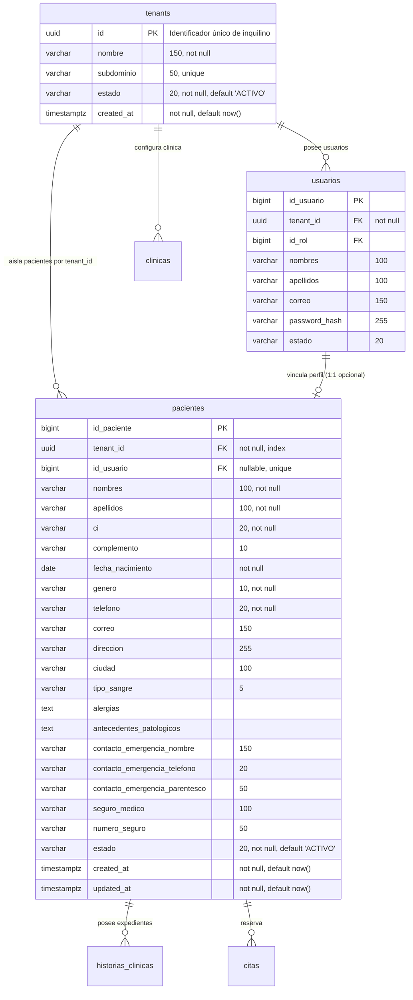

# Patient Management Specification (CU03)

**Capability ID:** `patient-management`  
**Caso de Uso Asociado:** CU03 - Gestión de Perfil y Expediente de Pacientes (HU1-15, HU1-16, HU1-17)  
**Requisito Funcional:** RF-03  
**Modelo de Servicio:** SaaS Multitenant (Shared Database, Shared Schema)  
**Materia:** Sistemas de Información II (SI2) - Grupo 3  
**Estado:** Especificación Formal Consolidada (OpenSpec / SDD)  

---

## Purpose
The system SHALL proveer la especificación formal y unificada para la administración integral de los datos personales, demográficos, clínicos base y de contacto de emergencia de los pacientes dentro de una plataforma Cloud SaaS Multitenant, garantizando el aislamiento lógico estricto de datos por inquilino (`tenant_id: UUID`) y sincronizando operaciones entre el Portal Web (Angular), la Aplicación Móvil (Flutter) y el Backend API RESTful (FastAPI + PostgreSQL Neon).

---

## Overview & Scope

### 1. Propósito y Límites del Sistema
El caso de uso **CU03: Gestión de Perfil y Expediente de Pacientes** comprende la administración integral de los datos personales, demográficos, clínicos base y de contacto de emergencia de los pacientes atendidos en los distintos centros de salud (hospitales, clínicas, consultorios privados y redes médicas) que operan como **Inquilinos (Tenants)** dentro de la plataforma SaaS.

Provee interfaces diferenciadas:
1. **Portal Web Administrativo y Médico (Angular):** Permite al personal de recepción, médicos y administradores de cada inquilino registrar nuevos pacientes, consultar expedientes de su clínica, realizar búsquedas avanzadas (por C.I., nombres, apellidos o estado), actualizar información sociodemográfica y médica de base, y gestionar el estado del paciente (activo/inactivo).
2. **Aplicación Móvil (Flutter) y Portal Web del Paciente:** Permite a los pacientes autenticados visualizar y actualizar sus propios datos personales, contactos de emergencia y preferencias en el contexto de la clínica o clínicas donde reciben atención, garantizando la sincronización bidireccional inmediata con el backend central.
3. **Backend API RESTful (FastAPI + PostgreSQL):** Proporciona la persistencia segura en esquema compartido, validaciones estrictas de negocio, particionamiento lógico mediante `tenant_id`, control de acceso por roles (RBAC) y auditoría de cambios por inquilino.

### 2. Actores del Sistema
| Actor | Rol en el CU03 |
|---|---|
| **Administrador de Tenant** | Acceso total dentro de su clínica/organización: registrar, consultar, editar datos y dar de baja lógica a pacientes de su inquilino. |
| **Personal de Recepción** | Alta de pacientes en la clínica, actualización de información personal/contacto y consulta para agendamiento dentro de su `tenant_id`. |
| **Médico / Especialista** | Consulta del expediente clínico base de los pacientes de su inquilino, actualización de antecedentes médicos y alergias. |
| **Paciente** | Consulta y actualización de su propio perfil, datos de contacto de emergencia y preferencias asociadas a sus atenciones. |

### 3. Precondiciones
1. El usuario debe estar debidamente autenticado en la plataforma (Web o Móvil) con un token JWT válido que contenga el claim `tenant_id` o proveer el encabezado HTTP `X-Tenant-ID` correspondiente (`CU01`).
2. El inquilino (`tenant_id`) debe existir y encontrarse en estado `ACTIVO` en la plataforma SaaS.
3. El usuario debe contar con los roles autorizados (`ADMIN`, `RECEPCION`, `MEDICO` o `PACIENTE`) dentro del inquilino correspondiente.
4. Para el auto-registro o consulta de perfil propio (`/pacientes/me`), el usuario debe poseer el rol `PACIENTE` y tener un registro de cuenta `Usuario` activo vinculado al inquilino.

### 4. Reglas de Negocio (RN)
- **RN-CU03-01 (Unicidad Compuesta por Inquilino):** La unicidad del documento de identidad (C.I. y complemento) y del correo electrónico se restringe al ámbito de cada inquilino (`tenant_id`). La clave de unicidad es compuesta: `UNIQUE(tenant_id, ci, complemento)` y `UNIQUE(tenant_id, correo)`. Esto permite que dos clínicas o consultorios distintos puedan registrar a un mismo paciente sin colisión ni rechazo en la base de datos.
- **RN-CU03-02 (Aislamiento Estricto de Datos entre Inquilinos):** Ningún usuario (administrador de clínica, médico o recepcionista) puede visualizar, listar, consultar por ID, modificar ni dar de baja registros de pacientes pertenecientes a un `tenant_id` distinto al de su sesión activa. Toda consulta rechaza el acceso cruzado respondiendo `404 Not Found` (para evitar fuga de información sobre la existencia de recursos) o `403 Forbidden`.
- **RN-CU03-03 (Inyección Obligatoria de Tenant en Mutaciones):** Toda operación de creación de paciente (`POST /api/v1/pacientes`) asocia irrevocablemente el `tenant_id` resuelto desde el token JWT o el header validado `X-Tenant-ID`. El cliente no puede forzar un `tenant_id` diferente al de su sesión.
- **RN-CU03-04 (Validación de Datos Obligatorios):** Son campos obligatorios: `tenant_id`, Nombres, Apellidos, Carnet de Identidad (C.I.), Fecha de Nacimiento, Género y Teléfono de Contacto.
- **RN-CU03-05 (Validación de Fecha de Nacimiento):** La fecha de nacimiento no puede ser posterior a la fecha actual del sistema. Para pacientes menores de 18 años, es obligatorio registrar los datos del tutor o contacto de emergencia.
- **RN-CU03-06 (Privacidad y Control de Acceso RBAC dentro del Tenant):** 
  - Un paciente solo puede leer y modificar sus propios datos personales.
  - El personal de recepción puede ver y modificar datos administrativos y de contacto, pero no antecedentes médicos confidenciales.
  - Los médicos pueden ver y modificar la ficha clínica base del paciente de su inquilino.
  - Los administradores de tenant gestionan la administración global de pacientes de su organización.
- **RN-CU03-07 (Baja Lógica / Soft Delete por Tenant):** Los registros de pacientes nunca se eliminan físicamente de la base de datos para preservar la integridad histórica y legal del expediente clínico. Se utiliza un campo `estado` (`ACTIVO`, `INACTIVO`, `SUSPENDIDO`) condicionado al `tenant_id`.
- **RN-CU03-08 (Trazabilidad y Auditoría Multitenant):** Toda operación de creación o modificación sobre el expediente del paciente debe registrar automáticamente la fecha, hora, identificador del usuario que realizó la acción y el `tenant_id` correspondiente.
- **RN-CU03-09 (Sincronización Web-Móvil):** Cualquier modificación realizada en la aplicación móvil o en la web debe reflejarse en un tiempo máximo de 5 segundos bajo condiciones de red estables (RNF-10).

### 5. Flujos de Trabajo

#### 5.1 Flujo Principal: Registro de Nuevo Paciente en Tenant (Web - Recepción/Admin)
1. El usuario de Recepción/Admin de la clínica accede al módulo "Gestión de Pacientes" y presiona "Nuevo Paciente".
2. El sistema presenta el formulario de registro solicitando datos personales (Nombres, Apellidos, C.I., Complemento, Fecha de Nacimiento, Género), datos de contacto (Teléfono, Correo, Dirección, Ciudad) y contacto de emergencia.
3. El usuario completa los campos obligatorios y envía el formulario.
4. El backend extrae el `tenant_id` del token JWT o header `X-Tenant-ID`.
5. El sistema valida los formatos de datos y verifica que el C.I. no esté registrado previamente **dentro de ese mismo tenant**.
6. El sistema persiste el nuevo registro en la tabla `pacientes` con el `tenant_id` del inquilino y estado `ACTIVO`.
7. El sistema retorna código HTTP `201 Created` con los datos del paciente creado, incluyendo su `id_paciente` y `tenant_id`.
8. El frontend muestra notificación de éxito y redirige a la lista o detalle del paciente.

#### 5.2 Flujo Secundario: Consulta y Búsqueda de Pacientes por Tenant (Web)
1. El usuario accede a la lista de pacientes de su clínica.
2. El frontend solicita al backend `GET /api/v1/pacientes` con parámetros de paginación (`page=1`, `page_size=10`) y filtros opcionales (`q=termino_busqueda`, `ci=numero`, `estado=ACTIVO`).
3. El backend valida permisos, inyecta el filtro `WHERE tenant_id = :current_tenant`, ejecuta la consulta optimizada y retorna exclusivamente los registros correspondientes a la organización del usuario.
4. El frontend renderiza la tabla de pacientes con opciones para ver detalle, editar o cambiar estado.

#### 5.3 Flujo Secundario: Consulta y Actualización de Perfil Propio (App Móvil / Paciente)
1. El paciente autenticado ingresa a la sección "Mi Perfil" en la app móvil Flutter.
2. La app ejecuta `GET /api/v1/pacientes/me` enviando el token JWT con el claim `tenant_id`.
3. El backend identifica el `id_usuario` y `tenant_id` a partir del token, localiza el registro del paciente asociado y responde con los datos.
4. El paciente modifica sus datos de contacto o contacto de emergencia y presiona "Guardar Cambios".
5. La app envía `PATCH /api/v1/pacientes/me` con el payload de campos modificados.
6. El backend valida y aplica los cambios manteniendo el aislamiento, retornando el registro actualizado.
7. La app actualiza el estado local y muestra confirmación al usuario.

#### 5.4 Flujos Alternativos y Excepciones
- **A1. C.I. o Correo ya registrado en el mismo Tenant (409 Conflict):** El sistema detiene la operación y notifica al usuario: *"Ya existe un paciente registrado con el documento de identidad ingresado en esta clínica"*.
- **A2. C.I. registrado en otro Tenant diferente (201 Created):** El sistema permite el registro sin conflicto, creando un registro independiente con el `tenant_id` de la clínica solicitante.
- **A3. Intento de acceso a paciente de otro Tenant (404 Not Found / 403 Forbidden):** Si un usuario intenta consultar o modificar un `id_paciente` que pertenece a un inquilino distinto, el backend responde `404 Not Found` impidiendo revelar la existencia de registros foráneos.
- **A4. Validación de campos fallida (422 Unprocessable Entity):** El sistema resalta los campos con error (ej. fecha de nacimiento en el futuro, formato de correo o teléfono inválido).
- **A5. Acceso No Autorizado o Tenant no provisto (401 / 403):** Si el token es inválido, el tenant está suspendido o no se pudo resolver el inquilino, el sistema deniega el acceso de inmediato.

### 6. Matriz de Trazabilidad de Requerimientos
| Código Requerimiento | Descripción | Componente Frontend Web | Componente Backend | Componente Móvil |
|---|---|---|---|---|
| **RF-03** | Gestión de pacientes multitenant | `patient-list`, `patient-form`, `patient-detail` | `pacientes` router, service, repository (`tenant_id`) | `patient_profile_view`, `edit_profile_view` |
| **HU1-15** | Formulario Web y listado de pacientes | `features/medical-records/patients/*` | `POST /api/v1/pacientes`, `GET /api/v1/pacientes` | N/A |
| **HU1-16** | Perfil de paciente en App Móvil | N/A | `GET /api/v1/pacientes/me`, `PATCH /api/v1/pacientes/me` | `features/medical_records/patient_profile/*` |
| **HU1-17** | Backend CRUD y lógica de aislamiento | N/A | `app/modules/medical_records/` (models, schemas, service) | N/A |
| **RNF-01** | Tiempo de respuesta < 2s | Índices en DB `(tenant_id, ...)`, paginación | Queries SQLAlchemy optimizadas con filtro tenant | Cache en memoria con Provider |
| **RNF-03** | Seguridad JWT, Tenant y RBAC | Interceptor HTTP con `X-Tenant-ID` | Dependencias `get_current_tenant`, `require_role` | Secure Storage para JWT con claim tenant |
| **RNF-06** | Integridad y Aislamiento de datos | Validadores reactivos Angular | Validadores Pydantic v2 y DB constraints compuestas | Validadores de formulario en Flutter |

---

## Domain Model

### 1. Diagrama Entidad-Relación Lógico (Mermaid)



### 2. Definición DDL PostgreSQL (Neon Serverless - Shared Database, Shared Schema)

```sql
-- Extensión requerida para soporte de UUIDs
CREATE EXTENSION IF NOT EXISTS "uuid-ossp";

-- Tabla de Inquilinos / Tenants (Clínicas u Organizaciones de Salud)
CREATE TABLE IF NOT EXISTS tenants (
    id UUID PRIMARY KEY DEFAULT uuid_generate_v4(),
    nombre VARCHAR(150) NOT NULL,
    subdominio VARCHAR(50) UNIQUE,
    nit VARCHAR(50),
    telefono VARCHAR(30),
    correo VARCHAR(150),
    direccion VARCHAR(250),
    estado VARCHAR(20) NOT NULL DEFAULT 'ACTIVO' CHECK (estado IN ('ACTIVO', 'INACTIVO', 'SUSPENDIDO')),
    created_at TIMESTAMPTZ NOT NULL DEFAULT CURRENT_TIMESTAMP,
    updated_at TIMESTAMPTZ NOT NULL DEFAULT CURRENT_TIMESTAMP
);

-- Creación de la tabla pacientes con discriminador tenant_id
CREATE TABLE IF NOT EXISTS pacientes (
    id_paciente BIGSERIAL PRIMARY KEY,
    tenant_id UUID NOT NULL REFERENCES tenants(id) ON DELETE CASCADE,
    id_usuario BIGINT UNIQUE REFERENCES usuarios(id_usuario) ON DELETE SET NULL,
    nombres VARCHAR(100) NOT NULL,
    apellidos VARCHAR(100) NOT NULL,
    ci VARCHAR(20) NOT NULL,
    complemento VARCHAR(10) DEFAULT '',
    fecha_nacimiento DATE NOT NULL,
    genero VARCHAR(10) NOT NULL CHECK (genero IN ('M', 'F', 'OTRO')),
    telefono VARCHAR(20) NOT NULL,
    correo VARCHAR(150),
    direccion VARCHAR(255),
    ciudad VARCHAR(100) DEFAULT 'Santa Cruz de la Sierra',
    tipo_sangre VARCHAR(5) CHECK (tipo_sangre IN ('A+', 'A-', 'B+', 'B-', 'AB+', 'AB-', 'O+', 'O-')),
    alergias TEXT,
    antecedentes_patologicos TEXT,
    contacto_emergencia_nombre VARCHAR(150),
    contacto_emergencia_telefono VARCHAR(20),
    contacto_emergencia_parentesco VARCHAR(50),
    seguro_medico VARCHAR(100),
    numero_seguro VARCHAR(50),
    estado VARCHAR(20) NOT NULL DEFAULT 'ACTIVO' CHECK (estado IN ('ACTIVO', 'INACTIVO', 'SUSPENDIDO')),
    created_at TIMESTAMPTZ NOT NULL DEFAULT CURRENT_TIMESTAMP,
    updated_at TIMESTAMPTZ NOT NULL DEFAULT CURRENT_TIMESTAMP
);

-- Índices de Aislamiento y Unicidad Compuesta por Tenant
CREATE UNIQUE INDEX IF NOT EXISTS uq_pacientes_tenant_ci_complemento 
    ON pacientes (tenant_id, ci, COALESCE(complemento, ''));

CREATE UNIQUE INDEX IF NOT EXISTS uq_pacientes_tenant_correo 
    ON pacientes (tenant_id, correo) 
    WHERE correo IS NOT NULL;

CREATE INDEX IF NOT EXISTS idx_pacientes_tenant_id ON pacientes (tenant_id);
CREATE INDEX IF NOT EXISTS idx_pacientes_tenant_nombres_apellidos ON pacientes (tenant_id, nombres, apellidos);
CREATE INDEX IF NOT EXISTS idx_pacientes_tenant_estado ON pacientes (tenant_id, estado);
CREATE INDEX IF NOT EXISTS idx_pacientes_tenant_id_usuario ON pacientes (tenant_id, id_usuario);
```

### 3. Definición del Modelo SQLAlchemy 2.0 (Python)

```python
import uuid
from datetime import date, datetime
from typing import Optional
from sqlalchemy import (
    BigInteger,
    Column,
    Date,
    DateTime,
    ForeignKey,
    Index,
    String,
    Text,
    UniqueConstraint,
    func
)
from sqlalchemy.dialects.postgresql import UUID
from sqlalchemy.orm import relationship
from app.core.database import Base


class Paciente(Base):
    __tablename__ = "pacientes"

    id_paciente = Column(BigInteger, primary_key=True, autoincrement=True, index=True)
    tenant_id = Column(UUID(as_uuid=True), ForeignKey("tenants.id", ondelete="CASCADE"), nullable=False, index=True)
    id_usuario = Column(BigInteger, ForeignKey("usuarios.id_usuario", ondelete="SET NULL"), unique=True, nullable=True, index=True)
    
    nombres = Column(String(100), nullable=False)
    apellidos = Column(String(100), nullable=False)
    ci = Column(String(20), nullable=False)
    complemento = Column(String(10), nullable=True, default="")
    fecha_nacimiento = Column(Date, nullable=False)
    genero = Column(String(10), nullable=False)  # M, F, OTRO
    
    telefono = Column(String(20), nullable=False)
    correo = Column(String(150), nullable=True)
    direccion = Column(String(255), nullable=True)
    ciudad = Column(String(100), nullable=True, default="Santa Cruz de la Sierra")
    
    tipo_sangre = Column(String(5), nullable=True)  # A+, O+, etc.
    alergias = Column(Text, nullable=True)
    antecedentes_patologicos = Column(Text, nullable=True)
    
    contacto_emergencia_nombre = Column(String(150), nullable=True)
    contacto_emergencia_telefono = Column(String(20), nullable=True)
    contacto_emergencia_parentesco = Column(String(50), nullable=True)
    
    seguro_medico = Column(String(100), nullable=True)
    numero_seguro = Column(String(50), nullable=True)
    
    estado = Column(String(20), nullable=False, default="ACTIVO", index=True)  # ACTIVO, INACTIVO
    created_at = Column(DateTime(timezone=True), server_default=func.now(), nullable=False)
    updated_at = Column(DateTime(timezone=True), server_default=func.now(), onupdate=func.now(), nullable=False)

    # Relaciones
    tenant = relationship("Tenant", backref="pacientes", lazy="joined")
    usuario = relationship("Usuario", backref="paciente_perfil", lazy="joined")

    __table_args__ = (
        UniqueConstraint("tenant_id", "ci", "complemento", name="uq_pacientes_tenant_ci_complemento"),
        Index("idx_pacientes_tenant_ci", "tenant_id", "ci"),
        Index("idx_pacientes_tenant_estado", "tenant_id", "estado"),
    )

    def __repr__(self) -> str:
        return f"<Paciente(id={self.id_paciente}, tenant={self.tenant_id}, ci='{self.ci}')>"
```

### 4. Diccionario de Datos

| Campo | Tipo PostgreSQL | Nullable | Default | Descripción |
|---|---|---|---|---|
| `id_paciente` | `BIGSERIAL` | No | Auto | Llave primaria secuencial del paciente. |
| `tenant_id` | `UUID` | No | - | Llave foránea que identifica al inquilino (clínica/organización). |
| `id_usuario` | `BIGINT` | Sí | `NULL` | Llave foránea a `usuarios` (cuenta de acceso opcional). |
| `nombres` | `VARCHAR(100)` | No | - | Nombres del paciente. |
| `apellidos` | `VARCHAR(100)` | No | - | Apellidos del paciente. |
| `ci` | `VARCHAR(20)` | No | - | Documento de Identidad (único junto con tenant_id y complemento). |
| `complemento` | `VARCHAR(10)` | Sí | `''` | Extensión o complemento de C.I. (ej. SC, LP, CB, 1A). |
| `fecha_nacimiento`| `DATE` | No | - | Fecha de nacimiento para cálculo de edad. |
| `genero` | `VARCHAR(10)` | No | - | Género biológico (`M`, `F`, `OTRO`). |
| `telefono` | `VARCHAR(20)` | No | - | Teléfono principal / WhatsApp. |
| `correo` | `VARCHAR(150)` | Sí | `NULL` | Correo electrónico de contacto (único por tenant_id). |
| `direccion` | `VARCHAR(255)` | Sí | `NULL` | Dirección de domicilio. |
| `ciudad` | `VARCHAR(100)` | Sí | `'Santa Cruz'`| Ciudad de residencia. |
| `tipo_sangre` | `VARCHAR(5)` | Sí | `NULL` | Grupo sanguíneo y factor RH. |
| `alergias` | `TEXT` | Sí | `NULL` | Alergias conocidas reportadas. |
| `antecedentes_patologicos` | `TEXT` | Sí | `NULL` | Enfermedades base (diabetes, HTA, asma). |
| `contacto_emergencia_nombre` | `VARCHAR(150)` | Sí | `NULL` | Nombre del tutor o contacto de emergencia. |
| `contacto_emergencia_telefono` | `VARCHAR(20)` | Sí | `NULL` | Teléfono del contacto de emergencia. |
| `contacto_emergencia_parentesco` | `VARCHAR(50)` | Sí | `NULL` | Parentesco (Madre, Padre, Cónyuge, etc.). |
| `seguro_medico` | `VARCHAR(100)` | Sí | `NULL` | Entidad o aseguradora de salud. |
| `numero_seguro` | `VARCHAR(50)` | Sí | `NULL` | Matrícula o póliza de seguro. |
| `estado` | `VARCHAR(20)` | No | `'ACTIVO'` | Estado del paciente (`ACTIVO`, `INACTIVO`). |
| `created_at` | `TIMESTAMPTZ` | No | `now()` | Fecha y hora de creación. |
| `updated_at` | `TIMESTAMPTZ` | No | `now()` | Fecha y hora de última actualización. |

---

## Requirements

### Requirement: Aislamiento Estricto Multitenant (SaaS Security)
The system SHALL garantizar el aislamiento estricto de los expedientes de pacientes entre diferentes organizaciones (tenants), impidiendo accesos cruzados y permitiendo registros con documento idéntico entre tenants distintos.

#### Scenario: Registro exitoso de pacientes con el mismo documento de identidad en tenants diferentes
- **GIVEN** que existe un paciente registrado con C.I. "7891234" en el tenant con UUID "11111111-1111-1111-1111-111111111111"
- **WHEN** un usuario con rol "RECEPCION" del tenant "22222222-2222-2222-2222-222222222222" envía una solicitud `POST /api/v1/pacientes` con el mismo C.I. "7891234"
- **THEN** el sistema responde con código HTTP `201 Created`
- **AND** el nuevo paciente queda registrado con `tenant_id` igual a "22222222-2222-2222-2222-222222222222"
- **AND** ambas clínicas mantienen sus expedientes totalmente independientes sin conflicto de unicidad

#### Scenario: Intento de consulta de un paciente perteneciente a otro inquilino (Cross-Tenant Access)
- **GIVEN** que existe un paciente con `id_paciente` 10 perteneciente al tenant "11111111-1111-1111-1111-111111111111"
- **WHEN** un médico autenticado del tenant "22222222-2222-2222-2222-222222222222" envía una solicitud `GET /api/v1/pacientes/10`
- **THEN** el sistema responde con código HTTP `404 Not Found`
- **AND** el mensaje de detalle indica "Paciente no encontrado"
- **AND** no se filtra ningún dato del paciente del otro inquilino

#### Scenario: Intento de modificación de un paciente perteneciente a otro inquilino
- **GIVEN** que existe un paciente con `id_paciente` 10 perteneciente al tenant "11111111-1111-1111-1111-111111111111"
- **WHEN** un usuario del tenant "22222222-2222-2222-2222-222222222222" envía una solicitud `PUT /api/v1/pacientes/10` con nuevos datos
- **THEN** el sistema deniega la mutación y responde con código HTTP `404 Not Found`
- **AND** los datos del paciente en el tenant original permanecen inalterados

### Requirement: Registro de Nuevos Pacientes (HU1-15, HU1-17)
The system SHALL permitir al personal con rol `ADMIN` o `RECEPCION` registrar a un nuevo paciente asociándolo automáticamente al `tenant_id` en contexto, validando obligatoriedad de campos y unicidad dentro del inquilino.

#### Scenario: Registro exitoso de un nuevo paciente por personal de Recepción
- **GIVEN** que el usuario autenticado tiene el rol "RECEPCION" o "ADMIN" en un tenant activo
- **WHEN** envía una solicitud `POST /api/v1/pacientes` con los datos del paciente (nombres, apellidos, CI, complemento, fecha de nacimiento, género, teléfono, correo, dirección, ciudad, tipo de sangre y contacto de emergencia)
- **THEN** el sistema responde con código HTTP `201 Created`
- **AND** el cuerpo de la respuesta contiene un campo `id_paciente` numérico y el `tenant_id` correspondiente
- **AND** el estado del paciente registrado es `ACTIVO`
- **AND** la fecha de creación `created_at` corresponde a la fecha y hora actual del servidor

#### Scenario: Intento de registro con datos obligatorios faltantes o formatos inválidos
- **GIVEN** que el usuario autenticado tiene el rol "RECEPCION"
- **WHEN** intenta registrar un paciente con campos vacíos o valores inválidos (ej. fecha de nacimiento en el futuro, género no soportado, correo sin formato válido)
- **THEN** el sistema rechaza la solicitud con código HTTP `422 Unprocessable Entity`
- **AND** la respuesta contiene el detalle del campo con error

#### Scenario: Intento de registro de un paciente con un C.I. ya existente en el mismo tenant
- **GIVEN** que ya existe en la base de datos un paciente con C.I. "7891234" y complemento "LP" bajo el mismo `tenant_id`
- **WHEN** un usuario del mismo tenant intenta registrar otro paciente con el mismo C.I. y complemento
- **THEN** el sistema responde con un código de estado HTTP `409 Conflict`
- **AND** el mensaje de error indica "Ya existe un paciente registrado con el documento de identidad ingresado"

### Requirement: Búsqueda y Listado Paginado de Pacientes (HU1-15, HU1-17)
The system SHALL proveer un listado paginado y con filtros de búsqueda acotado estrictamente al `tenant_id` del usuario solicitante para roles `ADMIN`, `RECEPCION` y `MEDICO`.

#### Scenario: Consulta de listado paginado de pacientes con filtros de búsqueda dentro del Tenant
- **GIVEN** que el usuario autenticado tiene el rol "RECEPCION", "MEDICO" o "ADMIN" en un tenant específico
- **AND** existen 25 pacientes registrados para ese `tenant_id` y otros pacientes en tenants ajenos
- **WHEN** envía una solicitud `GET /api/v1/pacientes?page=1&page_size=10&q=Mamani&estado=ACTIVO`
- **THEN** el sistema responde con código HTTP `200 OK`
- **AND** el cuerpo de la respuesta contiene la lista `items` paginada con máximo 10 elementos, `total`, `page` y `page_size`
- **AND** todos los registros devueltos pertenecen exclusivamente al `tenant_id` del usuario autenticado

#### Scenario: Consulta detallada del expediente base de un paciente por su ID
- **GIVEN** que el usuario autenticado tiene rol "MEDICO" o "ADMIN"
- **AND** existe un paciente con `id_paciente` 10 dentro de su mismo `tenant_id`
- **WHEN** envía una solicitud `GET /api/v1/pacientes/10`
- **THEN** el sistema responde con código HTTP `200 OK`
- **AND** la respuesta incluye todos los datos demográficos, clínicos base y el campo `tenant_id`

#### Scenario: Consulta de un paciente con identificador inexistente
- **GIVEN** que el usuario autenticado tiene rol "RECEPCION"
- **WHEN** envía una solicitud `GET /api/v1/pacientes/999999`
- **THEN** el sistema responde con código HTTP `404 Not Found`
- **AND** el mensaje de detalle indica "Paciente no encontrado"

### Requirement: Actualización del Expediente de Paciente (HU1-15, HU1-17)
The system SHALL permitir a usuarios autorizados (`ADMIN`, `RECEPCION`, `MEDICO`) modificar datos demográficos, de contacto y médicos de pacientes pertenecientes a su propio tenant preservando la trazabilidad.

#### Scenario: Actualización de datos de contacto y antecedentes por personal autorizado
- **GIVEN** que el usuario autenticado tiene rol "MEDICO" o "RECEPCION"
- **AND** existe un paciente con identificador válido en su mismo `tenant_id`
- **WHEN** envía una solicitud `PUT /api/v1/pacientes/{id_paciente}` con los campos modificados (teléfono, dirección, alergias, antecedentes patológicos)
- **THEN** el sistema responde con código HTTP `200 OK`
- **AND** los datos son persistidos en la base de datos manteniendo el mismo `tenant_id`
- **AND** el campo `updated_at` refleja la fecha y hora de la modificación

### Requirement: Gestión de Perfil Propio desde App Móvil (HU1-16, HU1-17)
The system SHALL permitir a un paciente autenticado consultar y actualizar de forma segura sus datos de contacto y emergencia desde la aplicación móvil Flutter dentro del contexto de su tenant.

#### Scenario: Paciente consulta su propio perfil desde la aplicación móvil
- **GIVEN** que el usuario autenticado tiene el rol "PACIENTE" con un perfil asociado en su tenant
- **WHEN** la app móvil envía una solicitud `GET /api/v1/pacientes/me`
- **THEN** el sistema responde con código HTTP `200 OK`
- **AND** devuelve la información correspondiente al paciente vinculado al usuario en dicho tenant

#### Scenario: Paciente actualiza sus datos de contacto de emergencia desde la app móvil
- **GIVEN** que el usuario autenticado tiene el rol "PACIENTE"
- **WHEN** la app móvil envía una solicitud `PATCH /api/v1/pacientes/me` con campos de contacto y emergencia
- **THEN** el sistema responde con código HTTP `200 OK`
- **AND** los datos quedan actualizados inmediatamente en el servidor bajo el mismo `tenant_id`
- **AND** la app móvil actualiza el estado local y presenta confirmación visual al usuario

### Requirement: Seguridad, Control de Acceso RBAC y Tenant Context
The system SHALL verificar rigurosamente la identidad, el tenant de sesión y los roles autorizados para cada operación, impidiendo accesos no autorizados y llamadas sin contexto de inquilino.

#### Scenario: Paciente intenta acceder a la lista general de todos los pacientes del tenant
- **GIVEN** que el usuario autenticado tiene el rol "PACIENTE"
- **WHEN** envía una solicitud `GET /api/v1/pacientes`
- **THEN** el sistema deniega el acceso y responde con código HTTP `403 Forbidden`
- **AND** el mensaje de detalle indica "No tiene los permisos requeridos para esta operación"

#### Scenario: Petición sin token de autenticación o con token expirado
- **GIVEN** que el cliente no envía el encabezado "Authorization" o envía un token JWT inválido
- **WHEN** intenta acceder a cualquier endpoint protegido de `/api/v1/pacientes`
- **THEN** el sistema responde con un código HTTP `401 Unauthorized`
- **AND** el mensaje indica "No autenticado o token expirado"

### Requirement: Baja Lógica de Pacientes por Tenant (Soft Delete)
The system SHALL preservar la integridad legal e histórica del expediente clínico dentro de cada inquilino, realizando únicamente bajas lógicas mediante el cambio de estado a `INACTIVO`.

#### Scenario: Administrador desactiva lógicamente el perfil de un paciente de su clínica
- **GIVEN** que el usuario autenticado tiene el rol "ADMIN" en su tenant
- **AND** existe un paciente con `id_paciente` en estado "ACTIVO" en su mismo tenant
- **WHEN** envía una solicitud `DELETE /api/v1/pacientes/{id_paciente}`
- **THEN** el sistema responde con código HTTP `200 OK`
- **AND** el paciente permanece en la base de datos con estado `INACTIVO` bajo su `tenant_id`
- **AND** el paciente ya no aparece en las búsquedas activas regulares de recepción

---

## Acceptance Criteria

```gherkin
Feature: CU03 - Gestión de Perfil y Expediente de Pacientes (SaaS Multitenant)
  Como personal de una organización de salud (Administrador, Recepcionista, Médico) o Paciente,
  Quiero registrar, consultar, buscar y actualizar la información de los pacientes de forma segura y aislada por tenant en la web y en la app móvil,
  Para mantener un expediente clínico actualizado, agilizar la atención médica y asegurar el aislamiento estricto de datos entre inquilinos.

  Background:
    Given que la API SaaS de Telemedicina y la base de datos PostgreSQL están operativas
    And que existen los roles de sistema "ADMIN", "RECEPCION", "MEDICO" y "PACIENTE"
    And que el usuario tiene una sesión iniciada con un token de acceso JWT válido que incluye el claim "tenant_id"

  # =========================================================================
  # 1. ESCENARIOS DE AISLAMIENTO MULTITENANT (CROSS-TENANT SECURITY)
  # =========================================================================

  @Security @Multitenant @HappyPath
  Scenario: Registro exitoso de pacientes con el mismo documento de identidad en tenants diferentes
    Given que existe un paciente registrado con C.I. "7891234" y complemento "LP" en el tenant "11111111-1111-1111-1111-111111111111"
    When un usuario con rol "RECEPCION" del tenant "22222222-2222-2222-2222-222222222222" envía una solicitud "POST /api/v1/pacientes" con:
      | campo            | valor           |
      | nombres          | Carlos Alberto  |
      | apellidos        | Gomez Perez     |
      | ci               | 7891234         |
      | complemento      | LP              |
      | fecha_nacimiento | 1988-03-20      |
      | genero           | M               |
      | telefono         | +591 72345678   |
    Then el sistema responde con un código de estado HTTP 201 Created
    And el paciente creado tiene "tenant_id" igual a "22222222-2222-2222-2222-222222222222"
    And no se produce colisión de unicidad con el paciente del tenant "11111111-1111-1111-1111-111111111111"

  @Security @Multitenant @Isolation @ErrorPath
  Scenario: Intento de consulta de un paciente perteneciente a otro inquilino
    Given que existe un paciente con "id_paciente" 10 registrado bajo el tenant "11111111-1111-1111-1111-111111111111"
    When un usuario autenticado con rol "MEDICO" perteneciente al tenant "22222222-2222-2222-2222-222222222222" envía una solicitud "GET /api/v1/pacientes/10"
    Then el sistema responde con código HTTP 404 Not Found
    And el mensaje de detalle indica "Paciente no encontrado"
    And no se expone ninguna información del paciente del tenant ajeno

  @Security @Multitenant @Isolation @ErrorPath
  Scenario: Intento de modificación de un paciente perteneciente a otro inquilino
    Given que existe un paciente con "id_paciente" 10 registrado bajo el tenant "11111111-1111-1111-1111-111111111111"
    When un usuario del tenant "22222222-2222-2222-2222-222222222222" envía una solicitud "PUT /api/v1/pacientes/10" con:
      | campo    | valor         |
      | telefono | +591 79999999 |
    Then el sistema responde con código HTTP 404 Not Found
    And el registro original en el tenant "11111111-1111-1111-1111-111111111111" no sufre modificaciones

  # =========================================================================
  # 2. ESCENARIOS DE REGISTRO DE PACIENTE (BACKEND & FRONTEND WEB)
  # =========================================================================

  @HU1-17 @HU1-15 @HappyPath @Web @Backend
  Scenario: Registro exitoso de un nuevo paciente por personal de Recepción
    Given que el usuario autenticado tiene el rol "RECEPCION" o "ADMIN" en un tenant activo
    When envía una solicitud "POST /api/v1/pacientes" con los siguientes datos:
      | campo                        | valor                   |
      | nombres                      | Carlos Alberto          |
      | apellidos                    | Mamani Terrazas         |
      | ci                           | 7891234                 |
      | complemento                  | LP                      |
      | fecha_nacimiento             | 1990-05-15              |
      | genero                       | M                       |
      | telefono                     | +591 71234567           |
      | correo                       | carlos.mamani@email.com |
      | direccion                    | Av. Banzer 4to Anillo   |
      | ciudad                       | Santa Cruz de la Sierra |
      | tipo_sangre                  | O+                      |
      | contacto_emergencia_nombre   | Maria Terrazas          |
      | contacto_emergencia_telefono | +591 79876543           |
    Then el sistema responde con un código de estado HTTP 201 Created
    And el cuerpo de la respuesta contiene un campo "id_paciente" numérico autoincremental
    And el campo "tenant_id" coincide con el identificador del tenant en sesión
    And el estado del paciente registrado es "ACTIVO"
    And la fecha de creación "created_at" corresponde a la fecha y hora actual del servidor

  @HU1-17 @HU1-15 @Validation @ErrorPath
  Scenario Outline: Intento de registro con datos obligatorios faltantes o formatos inválidos
    Given que el usuario autenticado tiene el rol "RECEPCION"
    When intenta registrar un paciente con "<campo>" con el valor "<valor_invalido>"
    Then el sistema rechaza la solicitud con un código HTTP 422 Unprocessable Entity
    And la respuesta contiene el detalle del error en el campo "<campo_error>"

    Examples:
      | campo            | valor_invalido | campo_error      |
      | nombres          |                | nombres          |
      | apellidos        |                | apellidos        |
      | ci               |                | ci               |
      | fecha_nacimiento | 2099-01-01     | fecha_nacimiento |
      | genero           | X              | genero           |
      | correo           | correo-invalido| correo           |

  @HU1-17 @HU1-15 @Conflict @ErrorPath
  Scenario: Intento de registro de un paciente con un C.I. ya existente en el mismo inquilino
    Given que ya existe en la base de datos un paciente con C.I. "7891234" y complemento "LP" bajo el mismo "tenant_id"
    When un usuario del mismo tenant intenta registrar otro paciente con el mismo C.I. "7891234" y complemento "LP"
    Then el sistema responde con un código de estado HTTP 409 Conflict
    And el mensaje de error indica "Ya existe un paciente registrado con el documento de identidad ingresado"

  # =========================================================================
  # 3. ESCENARIOS DE BÚSQUEDA Y LISTADO DE PACIENTES (FRONTEND WEB & BACKEND)
  # =========================================================================

  @HU1-17 @HU1-15 @HappyPath @Web @Pagination
  Scenario: Consulta de listado paginado de pacientes con filtros de búsqueda dentro del tenant
    Given que el usuario autenticado tiene el rol "RECEPCION", "MEDICO" o "ADMIN"
    And existen 25 pacientes registrados para su "tenant_id" en el sistema
    When envía una solicitud "GET /api/v1/pacientes?page=1&page_size=10&q=Mamani&estado=ACTIVO"
    Then el sistema responde con un código de estado HTTP 200 OK
    And el cuerpo de la respuesta contiene una lista "items" con máximo 10 elementos
    And el campo "total" refleja el número total de coincidencias encontradas dentro de su tenant
    And el campo "page" es 1 y "page_size" es 10
    And todos los registros devueltos pertenecen exclusivamente a su "tenant_id"

  @HU1-17 @HU1-15 @HappyPath @Web
  Scenario: Consulta detallada del expediente base de un paciente por su ID en el mismo tenant
    Given que el usuario autenticado tiene rol "MEDICO" o "ADMIN"
    And existe un paciente con "id_paciente" igual a 10 perteneciente a su tenant
    When envía una solicitud "GET /api/v1/pacientes/10"
    Then el sistema responde con código HTTP 200 OK
    And la respuesta incluye todos los datos demográficos, clínicos y el campo "tenant_id"

  @HU1-17 @HU1-15 @NotFound @ErrorPath
  Scenario: Consulta de un paciente con identificador inexistente
    Given que el usuario autenticado tiene rol "RECEPCION"
    When envía una solicitud "GET /api/v1/pacientes/999999"
    Then el sistema responde con un código de estado HTTP 404 Not Found
    And el mensaje de detalle indica "Paciente no encontrado"

  # =========================================================================
  # 4. ESCENARIOS DE ACTUALIZACIÓN DE DATOS (WEB & BACKEND)
  # =========================================================================

  @HU1-17 @HU1-15 @HappyPath @Web @Update
  Scenario: Actualización de datos de contacto y antecedentes por personal autorizado
    Given que el usuario autenticado tiene rol "MEDICO" o "RECEPCION"
    And existe un paciente con "id_paciente" igual a 5 en su mismo tenant
    When envía una solicitud "PUT /api/v1/pacientes/5" con los datos a modificar:
      | campo                    | valor                            |
      | telefono                 | +591 78899000                    |
      | direccion                | Av. San Martín Calle 7           |
      | alergias                 | Penicilina, AINEs                |
      | antecedentes_patologicos | Hipertensión arterial controlada |
    Then el sistema responde con un código HTTP 200 OK
    And los campos "telefono", "direccion", "alergias" y "antecedentes_patologicos" quedan actualizados en la base de datos
    And el campo "updated_at" refleja la fecha y hora de la modificación

  # =========================================================================
  # 5. ESCENARIOS DE APP MÓVIL (PERFIL DEL PACIENTE - HU1-16)
  # =========================================================================

  @HU1-16 @HU1-17 @HappyPath @Mobile
  Scenario: Paciente consulta su propio perfil desde la aplicación móvil
    Given que el usuario autenticado tiene el rol "PACIENTE" con "id_usuario" 42 en un tenant
    And dicho usuario tiene un perfil de paciente asociado en ese tenant
    When la app móvil envía una solicitud "GET /api/v1/pacientes/me"
    Then el sistema responde con código HTTP 200 OK
    And devuelve la información del paciente vinculado al usuario 42 en dicho tenant

  @HU1-16 @HU1-17 @HappyPath @Mobile @Update
  Scenario: Paciente actualiza sus datos de contacto de emergencia desde la app móvil
    Given que el usuario autenticado tiene el rol "PACIENTE"
    When la app móvil envía una solicitud "PATCH /api/v1/pacientes/me" con el payload:
      | campo                        | valor             |
      | telefono                     | +591 70011223     |
      | contacto_emergencia_nombre   | Roberto Mamani    |
      | contacto_emergencia_telefono | +591 76655443     |
    Then el sistema responde con código HTTP 200 OK
    And los datos de contacto y emergencia quedan actualizados inmediatamente en el servidor bajo el mismo tenant
    And la app móvil actualiza el estado local y presenta confirmación visual al usuario

  # =========================================================================
  # 6. ESCENARIOS DE SEGURIDAD Y CONTROL DE ACCESO (RBAC)
  # =========================================================================

  @Security @RBAC @ErrorPath
  Scenario: Paciente intenta acceder a la lista general de todos los pacientes de la clínica
    Given que el usuario autenticado tiene el rol "PACIENTE"
    When envía una solicitud "GET /api/v1/pacientes"
    Then el sistema deniega el acceso y responde con código HTTP 403 Forbidden
    And el mensaje de detalle indica "No tiene los permisos requeridos para esta operación"

  @Security @Auth @ErrorPath
  Scenario: Petición sin token de autenticación o con token expirado
    Given que el cliente no envía el encabezado "Authorization" o envía un token JWT inválido
    When intenta acceder a cualquier endpoint protegido de "/api/v1/pacientes"
    Then el sistema responde con un código HTTP 401 Unauthorized
    And el mensaje indica "No autenticado o token expirado"

  # =========================================================================
  # 7. ESCENARIOS DE BAJA LÓGICA (SOFT DELETE)
  # =========================================================================

  @HU1-17 @HU1-15 @SoftDelete @Admin
  Scenario: Administrador desactiva lógicamente el perfil de un paciente de su clínica
    Given que el usuario autenticado tiene el rol "ADMIN" en su tenant
    And existe un paciente con "id_paciente" 8 con estado "ACTIVO" en su mismo tenant
    When envía una solicitud "DELETE /api/v1/pacientes/8"
    Then el sistema responde con código HTTP 200 OK
    And el paciente con "id_paciente" 8 permanece en la base de datos con estado "INACTIVO" bajo su tenant
    And el paciente ya no aparece en las búsquedas activas regulares de recepción
```
