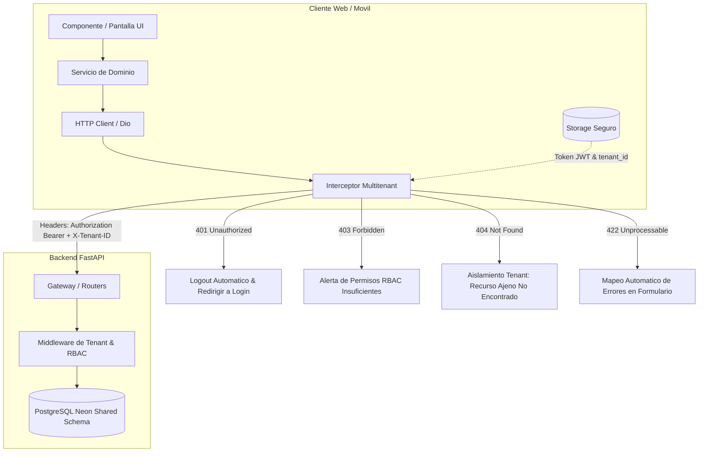

# System Design & UI/Mobile Specification

**Capability ID:** `system-design`  
**Alcance:** Frontend Web (Angular 19+ / Tailwind CSS v4) y Frontend Móvil (Flutter / Material 3)  
**Modelo de Servicio:** Cloud SaaS Multitenant (Shared Database, Shared Schema)  
**Materia:** Sistemas de Información II (SI2) - Grupo 3  
**Estado:** Especificación Formal de UI y Arquitectura de Clientes (OpenSpec / SDD)  

---

## Purpose
The system SHALL proveer la especificación técnica, visual y arquitectónica única para las aplicaciones cliente de la plataforma de Telemedicina (Portal Web en Angular y Aplicación Móvil en Flutter), garantizando la estandarización absoluta del Sistema de Diseño (Design Tokens Stitch), la reutilización del catálogo de componentes base, el aislamiento estricto de inquilinos (`tenant_id`) a nivel de red y almacenamiento local, y la trazabilidad exhaustiva de pantallas contra los casos de uso del Sprint 0 (CU01, CU02, CU03, CU04, CU23, CU24, CU26).

---

## Overview & Scope

### 1. Contexto y Objetivos de la Especificación
Esta especificación formaliza la capa de experiencia de usuario y arquitectura cliente para la plataforma Cloud SaaS Multitenant de Telemedicina:
1. **Unicidad Visual y Ergonomía (Design Tokens):** Garantizar que tanto el Portal Web como la Aplicación Móvil consuman exactamente los mismos valores semánticos de color, tipografía, espaciado, elevaciones y comportamientos interactivos exportados de las maquetas Stitch.
2. **Componentes Base Homologados:** Establecer los contratos de interfaz, estados y comportamientos de los componentes UI fundamentales (botones, campos de texto reactivos, selectores, modales, tablas paginadas, badges de estado y spinners).
3. **Aislamiento Multitenant Transversal:** Implementar la propagación determinista del `tenant_id` y del token JWT en cada interacción de red, protegiendo las credenciales en almacenamiento seguro y gestionando de forma semántica las respuestas de aislamiento (`401`, `403`, `404`, `422`).
4. **Trazabilidad Integral por Caso de Uso:** Asegurar que cada pantalla, vista o diálogo en Web y Móvil esté vinculado a su correspondiente contrato de API en `openspec/contracts/` y restringido por guardias de navegación RBAC.

---

## Design System & Tokens (Stitch Export)

### 1. Paleta de Colores Semántica y Tokens de Marca

Los valores cromáticos provienen de las maquetas oficiales Stitch y se implementan como variables de tema CSS en Tailwind v4 (`@theme`) y constantes `Color` en Flutter (`AppColors`):

| Token Semántico | Valor Hex / ARGB | Tailwind CSS (Angular) | Flutter Material 3 | Uso y Semántica |
|---|---|---|---|---|
| **Primary (Brand Navy)** | `#003667` / `0xFF003667` | `--color-primary` | `AppColors.primary` | Identidad clínica principal, barras de navegación, botones primarios |
| **Primary Container** | `#0a4d8c` / `0xFF0A4D8C` | `--color-primary-container` | `AppColors.primaryContainer` | Fondos de componentes destacados, hover de botones primarios |
| **On Primary** | `#ffffff` / `0xFFFFFFFF` | `--color-on-primary` | `AppColors.onPrimary` | Texto e iconos sobre fondos primarios |
| **Primary Fixed** | `#d4e3ff` / `0xFFD4E3FF` | `--color-primary-fixed` | `AppColors.primaryLight` | Contenedores suaves, acentos de selección, fondos de chips |
| **Primary Fixed Dim** | `#a5c8ff` / `0xFFA5C8FF` | `--color-primary-fixed-dim` | `Color(0xFFA5C8FF)` | Bordes sutiles con tono de marca, estados hover secundarios |
| **Secondary (Medical Teal)** | `#006b5f` / `0xFF006B5F` | `--color-secondary` | `AppColors.secondary` | Acciones de éxito/salud, acentos de telemedicina, badges activos |
| **Secondary Container** | `#6df5e1` / `0xFF6DF5E1` | `--color-secondary-container` | `AppColors.secondaryContainer` | Resaltados luminosos, fondos de insignias y tags médicos |
| **On Secondary** | `#ffffff` / `0xFFFFFFFF` | `--color-on-secondary` | `AppColors.onSecondary` | Texto sobre botones o badges secundarios |
| **Teal Accent** | `#14b8a6` / `0xFF14B8A6` | `--color-teal-accent` | `AppColors.tealAccent` | Indicadores de conexión en vivo, estados interactivos sutiles |
| **Background** | `#f8f9fa` / `0xFFF8F9FA` | `--color-background` | `AppColors.background` | Fondo global de la aplicación (Web y Móvil) |
| **Surface (Card Canvas)** | `#ffffff` / `0xFFFFFFFF` | `--color-surface-container-lowest` | `AppColors.surface` | Fondo de tarjetas, paneles modales y contenedores principales |
| **Surface Variant** | `#e1e3e4` / `0xFFF1F5F9` | `--color-surface-variant` | `AppColors.surfaceVariant` | Fondos de inputs deshabilitados, cabeceras de tablas |
| **Text Primary (High Contrast)**| `#191c1d` / `0xFF1E293B` | `--color-on-surface` | `AppColors.textPrimary` | Títulos principales, textos de lectura primaria, números |
| **Text Secondary (Medium)** | `#424750` / `0xFF64748B` | `--color-on-surface-variant` | `AppColors.textSecondary` | Subtítulos, labels de formularios, metadatos y fechas |
| **Text Muted / Placeholder** | `#727781` / `0xFF94A3B8` | `--color-outline` | `AppColors.textMuted` | Textos de ayuda, placeholders y estados deshabilitados |
| **Border / Outline** | `#c2c6d2` / `0xFFCBD5E1` | `--color-outline-variant` | `AppColors.outline` | Bordes de inputs, divisores y contornos de tarjetas |
| **Status Error** | `#ba1a1a` / `0xFFBA1A1A` | `--color-error` | `AppColors.error` | Mensajes de error de validación, botones destructivos |
| **Status Error Container** | `#ffdad6` / `0xFFFFDAD6` | `--color-error-container` | `AppColors.errorContainer` | Banners de alerta de error, fondos de inputs inválidos |
| **Status Success** | `#059669` / `0xFF059669` | `--color-success` | `AppColors.success` | Notificaciones de éxito, confirmaciones de guardado |
| **Status Success Container** | `#d1fae5` / `0xFFD1FAE5` | `--color-success-container`| `AppColors.successContainer`| Banners de confirmación, badges de estado "ACTIVO" |
| **Status Warning** | `#f59e0b` / `0xFFF59E0B` | `--color-warning` | `AppColors.warning` | Advertencias de rate limit, avisos de caducidad |
| **Status Warning Container** | `#fef3c7` / `0xFFFEF3C7` | `--color-warning-container`| `AppColors.warningContainer`| Banners de bloqueo temporal por intentos fallidos |

### 2. Escala Tipográfica (Google Font 'Inter')

| Nivel Tipográfico | Tamaño (px) | Line Height | Peso | Tracking | Uso en UI |
|---|---|---|---|---|---|
| **Display Large** | `36px` (2.25rem) | `44px` | Bold (700) | `-0.02em` | Encabezados principales en Landing y Login hero |
| **Headline Large** | `28px` (1.75rem) | `36px` | Bold (700) | `-0.01em` | Títulos de pantallas principales (Pacientes, Médicos, Usuarios) |
| **Title Medium** | `20px` (1.25rem) | `28px` | SemiBold (600) | `0em` | Títulos de tarjetas, diálogos y modales |
| **Title Small** | `16px` (1.00rem) | `24px` | SemiBold (600) | `0em` | Subtítulos de sección, cabeceras de grupos en tablas |
| **Body Large** | `16px` (1.00rem) | `24px` | Regular (400) | `0em` | Textos de lectura, párrafos descriptivos |
| **Body Medium** | `14px` (0.875rem) | `20px` | Regular (400) | `0.01em` | Textos de inputs, celdas de tablas, alertas |
| **Label Medium** | `12px` (0.75rem) | `16px` | Medium (500) | `0.05em` | Labels de formularios, badges de estado, tabs |
| **Label Small** | `11px` (0.6875rem)| `14px` | SemiBold (600) | `0.08em` | Textos de fortaleza de clave, contadores, timestamps |

### 3. Breakpoints Responsivos y Layout

- **Mobile First (< 640px - `sm`):** Layout en 1 columna, navegación inferior (Bottom Navigation Bar en Móvil, Header compacto en Web), márgenes laterales fijos de `16px` (`px-margin-mobile`).
- **Tablet (640px a 1024px - `md` / `lg`):** Layout en rejilla de 2 columnas para formularios, modales centrados al 80% de ancho de pantalla, drawer colapsable.
- **Desktop (>= 1024px - `xl`):** Sidebar de navegación lateral persistente, margen lateral de `48px` (`px-margin-desktop`), ancho máximo de contenedor `1440px`, tablas con scroll horizontal nativo si exceden columnas.

### 4. Elevaciones y Sombras (Material Depth)

- **Nivel 0 (Flat):** `box-shadow: none;` (Fondos, canvas general, divisores).
- **Nivel 1 (Cards & List Items):** `shadow-level-1` ➔ `0 1px 3px rgba(0,0,0,0.08), 0 1px 2px rgba(0,0,0,0.04)`.
- **Nivel 2 (Dropdowns & Floating Actions):** `shadow-level-2` ➔ `0 4px 6px -1px rgba(0,0,0,0.1), 0 2px 4px -1px rgba(0,0,0,0.06)`.
- **Nivel 3 (Modals & Overlays):** `shadow-level-3` ➔ `0 10px 25px -5px rgba(0,0,0,0.15), 0 8px 10px -6px rgba(0,0,0,0.08)`.

---

## Catálogo de Componentes Base Reutilizables

### 1. Botones (`AppButton` / `CustomElevatedButton`)
- **Variantes:**
  - `Primary`: Fondo `--color-primary`, texto blanco, hover `--color-primary-container`.
  - `Secondary`: Fondo `--color-secondary`, texto blanco, hover `--color-secondary-container`.
  - `Outline`: Fondo transparente, borde `1.5px` en `--color-primary` o `--color-outline`, texto de marca.
  - `Danger / Destructive`: Fondo `--color-error`, texto blanco, para bajas lógicas y revocación.
  - `Ghost / Link`: Sin borde ni fondo, texto `--color-primary`, para navegación secundaria.
- **Estados:** `Default`, `Hover`, `Focus-visible` (ring de 3px con opacity 20%), `Active`, `Disabled` (opacidad 50%, cursor `not-allowed`), `Loading` (deshabilita clic y renderiza spinner centrado).

### 2. Campos de Texto Reactivos (`AppInputField` / `CustomTextFormField`)
- **Estructura:** Label superior con indicador de obligatoriedad (`*`), contenedor con icono prefix opcional, input nativo con tipografía `Body Medium`, botón de suffix opcional (ej. toggle de visibilidad de contraseña `visibility`/`visibility_off`), y contenedor de error inferior con icono `error` de 14px.
- **Estados de Validación:**
  - `Pristine / Untouched`: Borde neutro `--color-outline-variant`.
  - `Focused`: Borde `--color-primary` o `--color-secondary`, ring de `4px` con opacidad `15%`.
  - `Invalid & Touched`: Borde `--color-error`, ring de error, mensaje de error en texto rojo `12px`.
  - `Disabled`: Fondo `--color-surface-variant`, texto atenuado, sin interactividad.

### 3. Selectores y Dropdowns (`AppSelect` / `CustomDropdownField`)
- Dropdowns estandarizados con soporte para opciones con valor y etiqueta visible, búsqueda integrada para listas largas (ej. selección de especialidades médicas o roles) y soporte para valor nulo inicial con placeholder claro ("Seleccione una opción...").

### 4. Modales de Confirmación y Diálogos (`ConfirmationModal` / `CustomAlertDialog`)
- Contenedor flotante con `backdrop-blur-md` y fondo semitransparente oscuro (`rgba(0,0,0,0.4)`), animación suave de entrada `fade-in-scale`, título enfático, mensaje explicativo del impacto de la acción, botón de cancelación neutro y botón de acción (Primario o Destructivo).

### 5. Tablas de Datos Paginadas (`AppDataTable` / ListView Móvil)
- **Web (Angular):** Cabeceras ordenables, filas alternadas con hover suave, paginador integrado con selección de `pageSize` (10, 25, 50), indicador de registros totales y estado vacío con ilustración/icono representativo cuando `total === 0`.
- **Móvil (Flutter):** Tarjetas en lista (`ListView.builder`) con scroll infinito / pull-to-refresh, separadores sutiles y acciones rápidas deslizables o botones de acción en tarjeta.

### 6. Badges de Estado y Roles (`StatusBadge` / `RoleChip`)
- **Estados Clínicos:**
  - `ACTIVO`: Fondo verde claro (`bg-emerald-100` / `0xFFD1FAE5`), texto verde oscuro (`text-emerald-800`), icono check.
  - `INACTIVO` / `SUSPENDIDO`: Fondo rojo o ámbar claro, texto oscuro correspondiente.
- **Chips de Rol RBAC:**
  - `ADMIN`: Azul marino con borde primario.
  - `MEDICO`: Teal médico con icono de estetoscopio (`local_hospital`).
  - `RECEPCION`: Morado / Lavanda suave.
  - `PACIENTE`: Gris azulado neutro.

### 7. Indicadores de Carga (`AppSpinner` / `LoadingOverlay`)
- Spinner circular animado SVG en Angular (`animate-spin`) y `CircularProgressIndicator` en Flutter con color primario.
- Soporte para componentes `SkeletonLoader` en tablas y formularios durante peticiones iniciales para evitar saltos de layout (CLS - Cumulative Layout Shift).

---

## Arquitectura Multitenant en Clientes (Web y Móvil)



### 1. Detección y Almacenamiento Seguro del Contexto de Inquilino

1. **Resolución en Inicio de Sesión (`CU01`):**
   Al autenticarse exitosamente, el backend retorna:
   ```json
   {
     "access_token": "eyJhbGciOi...",
     "refresh_token": "eyJhbGciOi...",
     "token_type": "bearer",
     "tenant_id": "a0eebc99-9c0b-4ef8-bb6d-6bb9bd380a11",
     "usuario": { "id_usuario": 1, "correo": "...", "rol": "ADMIN" }
   }
   ```
2. **Persistencia en Web (Angular):**
   - El token de acceso y los datos del usuario se almacenan en `sessionStorage` o `localStorage`.
   - El `tenant_id` se almacena bajo la clave persistente `'tenant_id'`.
   - Se provee una señal reactiva `currentTenantId = signal<string | null>(...)` en `TenantService` que sincroniza el estado de la UI.
3. **Persistencia en Móvil (Flutter):**
   - El almacenamiento se realiza estrictamente en `FlutterSecureStorage` utilizando encriptación nativa (Android Keystore con AES-GCM / iOS Keychain).
   - Se prohíbe el uso de `SharedPreferences` para tokens o identificadores de inquilino.

### 2. Inyección Transversal en Llamadas HTTP (Interceptores)

Toda petición saliente originada en Web o Móvil debe incorporar obligatoriamente:
- **`Authorization: Bearer <access_token>`** (excepto en rutas públicas como `/auth/login` y `/auth/forgot-password`).
- **`X-Tenant-ID: <UUID>`** obtenido del contexto activo.

#### Contrato del Interceptor Web (Angular `tenant.interceptor.ts` & `auth.interceptor.ts`):
```typescript
export const tenantInterceptor: HttpInterceptorFn = (req, next) => {
  const tenantService = inject(TenantService);
  const tenantId = tenantService.getTenantId();

  if (tenantId && !req.headers.has('X-Tenant-ID')) {
    req = req.clone({
      setHeaders: { 'X-Tenant-ID': tenantId }
    });
  }
  return next(req);
};
```

#### Contrato del Interceptor Móvil (Flutter `TenantInterceptor` con Dio):
```dart
class TenantInterceptor extends Interceptor {
  final SecureStorageService _storage;
  TenantInterceptor(this._storage);

  @override
  Future<void> onRequest(RequestOptions options, RequestInterceptorHandler handler) async {
    final tenantId = await _storage.getTenantId();
    final token = await _storage.getAccessToken();

    if (tenantId != null && !options.headers.containsKey('X-Tenant-ID')) {
      options.headers['X-Tenant-ID'] = tenantId;
    }
    if (token != null && !options.headers.containsKey('Authorization')) {
      options.headers['Authorization'] = 'Bearer $token';
    }
    return handler.next(options);
  }
}
```

### 3. Manejo Unificado de Respuestas y Códigos de Error HTTP

| Código HTTP | Causa en Arquitectura Multitenant | Comportamiento Estándar en Clientes (Web y Móvil) |
|---|---|---|
| **`401 Unauthorized`** | Token JWT expirado, token revocado en `token_blacklist` (`CU24`), firma inválida o versión de token superada (`token_version`). | El cliente borra los tokens de sesión, detiene el timer de inactividad, limpia las señales reactivas y redirige al usuario a `/login` mostrando: *"Tu sesión ha expirado. Por favor, inicia sesión nuevamente."* |
| **`403 Forbidden`** | El usuario no cuenta con los permisos RBAC dentro del inquilino, o el inquilino se encuentra suspendido. | La interfaz bloquea la acción, no redirige a login y presenta un diálogo/banner de advertencia: *"Acceso restringido: No cuentas con autorización para ejecutar esta acción en tu centro de salud."* |
| **`404 Not Found`** | **Aislamiento Multitenant Estricto:** El registro solicitado pertenece a otro `tenant_id` o no existe. | El cliente no delata si el recurso existe en otra clínica. Presenta pantalla o estado vacío: *"El recurso solicitado no fue encontrado en este centro de salud."* |
| **`409 Conflict`** | Colisión de clave única compuesta por tenant (ej. `UNIQUE(tenant_id, ci)` en pacientes o `UNIQUE(tenant_id, matricula)` en médicos). | El formulario resalta el campo en conflicto y notifica: *"El valor ingresado ya se encuentra registrado en esta clínica."* |
| **`422 Unprocessable Entity`** | Violación de restricciones de contrato Pydantic v2 (ej. contraseña menor a 8 caracteres, formato de correo erróneo). | El cliente extrae el arreglo `detail` de la respuesta y marca cada campo reactivo con su mensaje específico en rojo sin recargar la pantalla. |
| **`429 Too Many Requests`**| Bloqueo por exceso de intentos en login o recuperación de clave (Rate Limiting). | Bloqueo temporal del botón de acción, contador descendente en pantalla: *"Demasiados intentos fallidos. Intenta nuevamente en X minutos."* |

---

## Matriz de Trazabilidad de UI por Caso de Uso (Sprint 0)

| Caso de Uso | Nombre del CU | Ruta Web (Angular) | Pantalla Móvil (Flutter) | Roles RBAC Permitidos | Contrato de API en OpenSpec |
|---|---|---|---|---|---|
| **`CU01`** | Inicio de Sesión Multitenant | `/login` | `LoginScreen` | Público / Todos | `openspec/contracts/auth.md` (`POST /api/v1/auth/login`) |
| **`CU02`** | Gestión de Usuarios Internos | `/usuarios` | `UserListScreen` (Admin) | `ADMIN` | `openspec/contracts/auth.md` (`/api/v1/auth/users`) |
| **`CU03`** | Expediente y Perfil de Pacientes | `/pacientes`, `/pacientes/:id` | `PatientProfileScreen`, `EditProfileScreen` | `ADMIN`, `RECEPCION`, `MEDICO`, `PACIENTE` | `openspec/contracts/pacientes.md` (`/api/v1/pacientes`) |
| **`CU04`** | Gestión de Médicos y Especialidades | `/medicos`, `/medicos/:id` | `DoctorCatalogScreen`, `DoctorDetailScreen` | `ADMIN`, `MEDICO`, `PACIENTE` (Catálogo) | `openspec/contracts/medicos.md` (`/api/v1/appointments/medicos`) |
| **`CU23`** | Recuperación de Contraseñas | `/recuperar`, `/recuperar-contrasena` | `ForgotPasswordScreen`, `ResetPasswordScreen` | Público / Todos | `openspec/contracts/auth.md` (`/forgot-password`, `/reset-password`) |
| **`CU24`** | Cierre de Sesión Seguro | Acción en Header / Nav | Acción en Drawer / Perfil | Autenticado / Todos | `openspec/contracts/auth.md` (`POST /api/v1/auth/logout`) |
| **`CU26`** | Matriz de Roles y Permisos | `/roles` | N/A (Solo Web Admin) | `ADMIN` | `openspec/contracts/auth.md` (`/api/v1/auth/roles`, `/permissions`) |

---

## Requirements

### Requirement: Consistencia y Uniformidad de Tokens de Diseño
The system SHALL aplicar de forma idéntica e inmutable la paleta cromática, escalas tipográficas y elevaciones definidas en esta especificación en todas las interfaces del Portal Web (Angular con Tailwind CSS v4) y de la Aplicación Móvil (Flutter con Material 3), prohibiendo el uso de colores hexadecimales arbitrarios o estilos ad-hoc no registrados en el catálogo de tokens.

#### Scenario: Renderizado visual consistente de botones primarios en Web y Móvil
- **GIVEN** que se renderiza un botón de acción principal en el Portal Web o en la App Móvil
- **WHEN** el componente se visualiza en estado predeterminado
- **THEN** el fondo del botón utiliza exactamente el color primario institucional `#003667`
- **AND** el texto renderiza en blanco con tipografía `Inter` en peso semi-negrita (`font-semibold` / `FontWeight.w600`)
- **AND** al recibir interacción de hover o touch, la superficie transiciona suavemente a `#0A4D8C`

---

### Requirement: Validación Reactiva y Accesibilidad en Formularios
The system SHALL validar de forma reactiva y en tiempo real todos los campos de entrada de datos en Web y Móvil, sincronizando estrictamente las reglas de validación (longitudes mínimas, expresiones regulares, formatos de correo y campos requeridos) con los contratos de API de OpenSpec antes de permitir el envío al backend.

#### Scenario: Validación preventiva de contraseña en recuperación de acceso
- **GIVEN** que el usuario se encuentra en la pantalla de restablecimiento de contraseña (`/recuperar-contrasena` o `ResetPasswordScreen`)
- **WHEN** introduce una contraseña con longitud menor a 8 caracteres (ej. "123456")
- **THEN** el formulario marca el campo en estado inválido con borde rojo `#BA1A1A`
- **AND** muestra el mensaje de error "Mínimo 8 caracteres."
- **AND** deshabilita el botón de confirmación previniendo errores HTTP 422 en el backend

---

### Requirement: Aislamiento Multitenant Transversal e Interceptores HTTP
The system SHALL interceptar todas las peticiones HTTP salientes desde Web y Móvil hacia el backend de Telemedicina para inyectar automáticamente el encabezado `X-Tenant-ID: <UUID>` y `Authorization: Bearer <Token>` correspondientes al contexto de sesión activo, garantizando que ninguna solicitud transaccional viaje sin identificación de inquilino.

#### Scenario: Inyección automática de encabezados en consulta de pacientes
- **GIVEN** que un usuario recepcionista ha iniciado sesión con el inquilino "Clínica San Lucas" (`tenant_id: 11111111-...`)
- **WHEN** navega al módulo de pacientes provocando una petición `GET /api/v1/pacientes`
- **THEN** el interceptor de red inyecta el encabezado `X-Tenant-ID: 11111111-...`
- **AND** el encabezado `Authorization: Bearer <token>`
- **AND** si el backend responde con código `404 Not Found` por tratarse de un recurso ajeno, el cliente notifica que el paciente no existe en dicha clínica sin revelar datos externos

---

### Requirement: Protección de Rutas y Guardias de Seguridad (RBAC Guards)
The system SHALL proteger todas las rutas y pantallas privadas mediante guardias de navegación (`authGuard`, `roleGuard`), impidiendo que usuarios no autenticados o con roles incompatibles carguen vistas restringidas (como administración de roles o usuarios).

#### Scenario: Intento de acceso a la pantalla de Roles por un usuario sin rol ADMIN
- **GIVEN** que un usuario autenticado con rol `MEDICO` intenta ingresar directamente a `/roles`
- **WHEN** el enrutador de Angular procesa la navegación
- **THEN** el guardia `roleGuard` evalúa los permisos del usuario activo
- **AND** deniega el acceso cancelando la transición y redirigiendo a la pantalla de inicio o perfil con una notificación de permiso denegado

---

## Acceptance Criteria

1. **Cumplimiento de Tokens:** El 100% de los componentes de `frontend_Telemedicina` y `mobile_telemedicina` referencian los tokens del Design System sin códigos de color hardcodeados.
2. **Interceptores Homologados:** Las suites de red en Web (`tenant.interceptor.ts`, `auth.interceptor.ts`) y Móvil (`TenantInterceptor`) inyectan `X-Tenant-ID` y `Authorization` de manera determinista.
3. **Manejo de Errores Semántico:** Los códigos `401`, `403`, `404` y `422` activan flujos de UX específicos sin pantallas en blanco ni excepciones no controladas.
4. **Validación OpenSpec:** La especificación pasa sin advertencias ni errores con `openspec validate --specs`.
